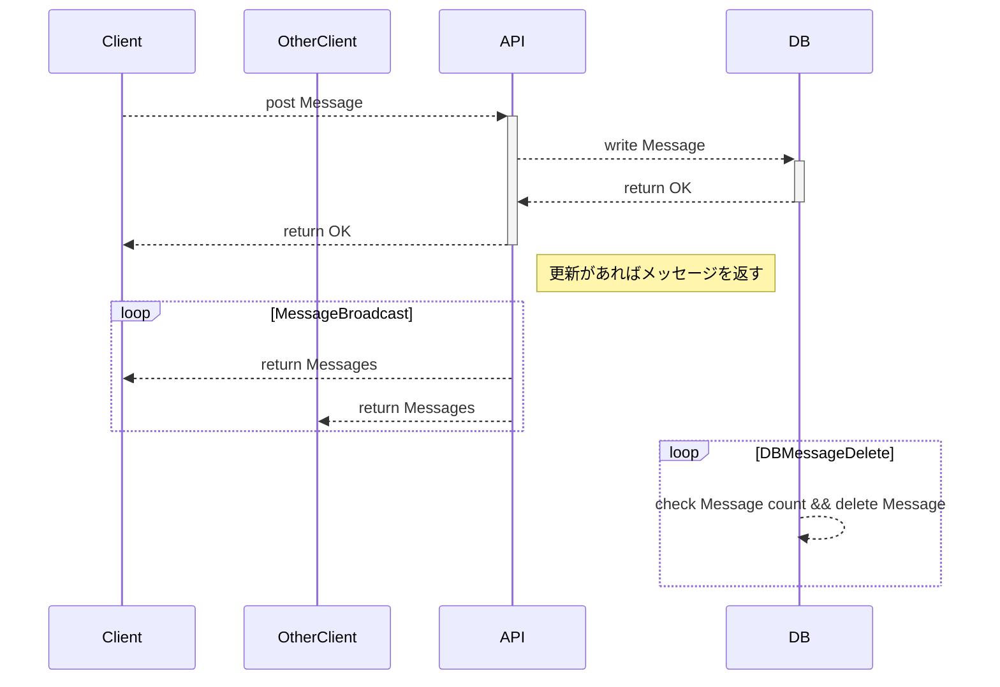
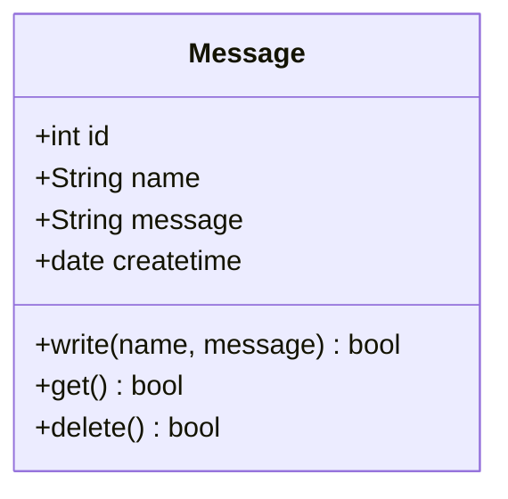

# 仕様/技術要件

## 機能

1) リアルタイムにチャットを送れる・見れる
2) ログは最新～30件程度閲覧できる
3) DBには表示分以外のログを残さない
4) ワンページ（画面はチャットルームのみ）

## 技術選定

1) バックエンド：GoでAPIを用意する
    - DB操作：GORM(仮)
    - 対クライアント：Gin + WebSocket
2) フロントエンド：JSでAPIを叩く

## ディレクトリ構成

- app   : バックエンド  API実装まで
    - api: 
    - dbcontroller: dbとのコミュニケーション
- db    : データベース
- public: フロントエンド APIを叩く

## API設計

(chat-room-usecase.drawioも参照すること)
- getMessage
    - クライアントが初接続時に叩くAPI　最新のメッセージを規定件数取得する
- postMessage
    - クライアントがメッセージを投稿するときに叩くAPI

## ダイアグラム

クラス

