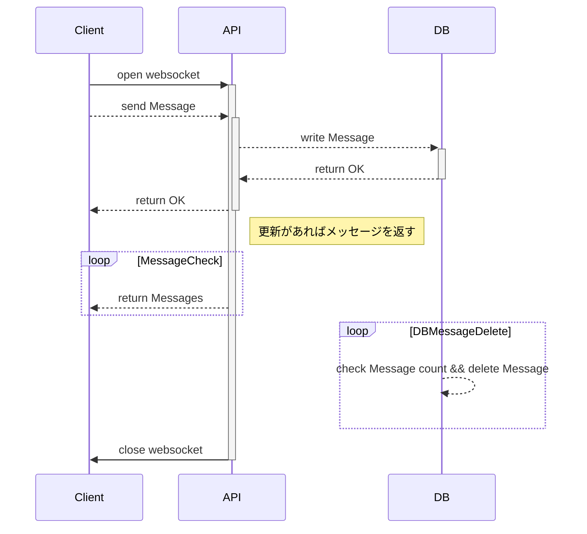
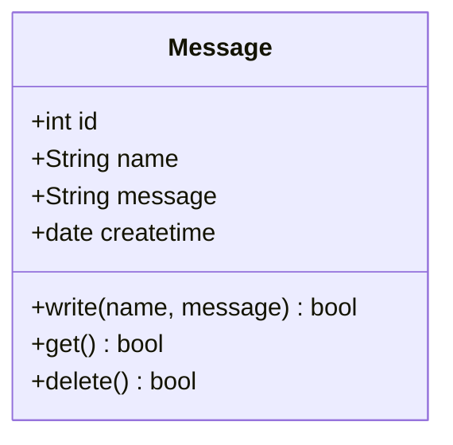

ダイアグラム

```mermaid
sequenceDiagram
    participant C as Client
    participant S as API
    participant D as DB
    C->>+S: open websocket

    C-->>+S: send Message
    S-->>+D: write Message
    D-->>-S: return OK
    S-->>-C: return OK

    Note right of S: 更新があればメッセージを返す
    loop MessageCheck
        S-->>C: return Messages
    end

    loop DBMessageDelete
        D-->>D: check Message count && delete Message
    end

    S->>-C: close websocket
```

クラス

```mermaid
classDiagram
    class Message{
        +int id
        +String name
        +String message
        +date createtime
        +write(name, message) bool
        +get() bool 
        +delete() bool
    }
```
