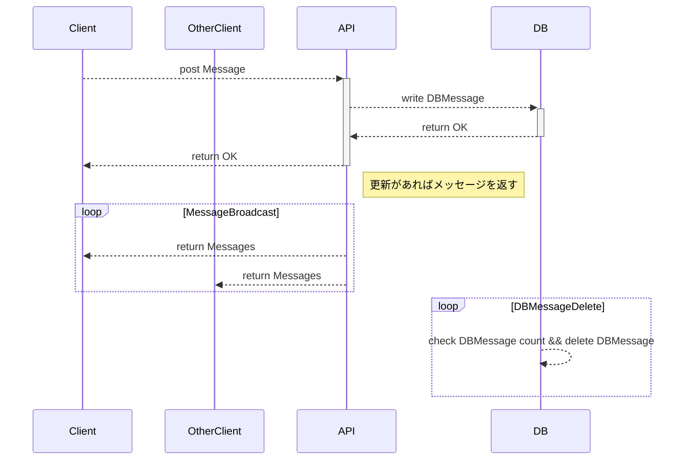
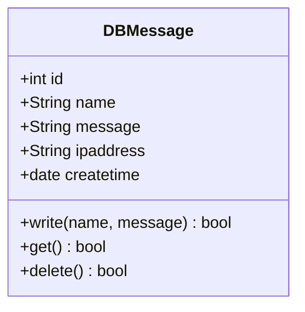

# 仕様/技術要件

## 機能要件

1) リアルタイムにチャットを送れる・見れる
2) ユーザーネームはクライアント側に表示、クライアントが決定する　デフォルト：858585
3) ipごとでユーザーネームに色を付ける
4) サーバー側にipバン機能がある 海外ipは弾く
5) ログは最新～30件程度閲覧できる
6) DBには表示分以外のログを残さない
7) ワンページ（画面はチャットルームのみ）
8) 名前、メッセージには最大文字数に制限がある
9) 文字数制限を超える場合、はみ出た部分はすべて1文字の"…"に変換されて正常に書き込まれる

```
[@ユーザーネーム][yyyy/mm/dd hh:mm:ss]おはようございます！
 ↑@●●の部分はipごとに色がつく
```

## 非機能要件

エラー対応、技術制約、保証など

### やること

1) メッセージの時刻はサーバーへの到達順で管理
2) メッセージの送信失敗時はクライアント側にエラーメッセージを表示する

### やらないこと

1) クライアント側の表示順は送信順で保証しない

## 技術選定

1) バックエンド：GoでAPIを用意する
    - DB操作：GORM(仮)
    - 対クライアント：Gin + WebSocket
2) サーバー・クライアント間通信：WebSocketで完結させる
3) フロントエンド：JSでAPIを叩く
4) 動作デバイスはrhaspberry-pi3b上でdocker環境を想定
5) alpine系でgoの公式イメージを想定

## ディレクトリ構成

- app   : バックエンド  API実装まで
    - api: 
    - dbcontroller: dbとのコミュニケーション
- db    : データベース
- public: フロントエンド APIを叩く

## API設計

(chat-room-usecase.drawioも参照すること)
- getMessage
    - クライアントが初接続時に叩くAPI　最新のメッセージを規定件数取得する
- postMessage
    - クライアントがメッセージを投稿するときに叩くAPI
- (broadcast)
    - サーバーからメッセージを配信するとき

### getMessage

from client
```json
{
    "method": "getMessage"
}
```

from server
```json
{
    "count": 10,
    "data": [
        {
            "name":"ユーザーが決めた名前",
            "message":"投稿するメッセージ(半角1文字以上)",
            "createtime": "2022-10-1 10:10:10.111"
        },
        {},
    ]
}
```

### postMessage

from client

```json
{
    "method": "postMessage",
    "name":"ユーザーが決めた名前",
    "message":"投稿するメッセージ(半角1文字以上)"
}
```

from server

```json
{
    "status": "OK"
}
```

```json
{
    "status": "error"
}
```

### (broadcast)

from server

```json
{
    "count": 1,
    "data": [
        {
            "name":"ユーザーが決めた名前",
            "message":"投稿するメッセージ(半角1文字以上)",
            "createtime": "2022-10-1 10:10:10.111"
        }
    ]
}
```

## ダイアグラム



クラス


